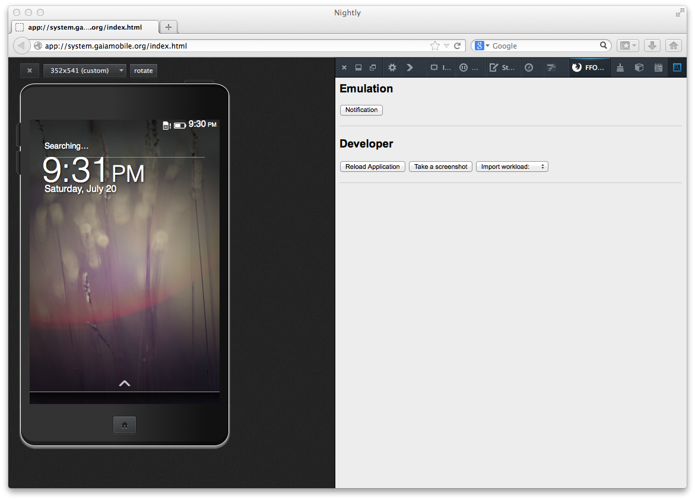

# Running Gaia on your computer

The reasons for wanting to run Gaia on your computer are many and diverse. Maybe you want to help developing, or want to see its internals in action? Or even more: want to see how your apps work in different versions of Gaia?

## Requirements

You will need a development environment set up. In other words, this means that you need to have a working compiler. This depends on the specific platform you're using, so refer to wherever is appropriate. You also need [git](http://git-scm.com/) to obtain the code, and [Firefox](http://www.firefox.com) (preferrably a [Nightly](http://nightly.mozilla.org/) version) to *actually* execute Gaia.

## Building

Once the compiler and git requirements are sorted out, clone [the Gaia repository](https://github.com/mozilla-b2g/gaia):

```bash
git clone https://github.com/mozilla-b2g/gaia
```

Then, to build it:

```bash
cd gaia
DESKTOP=1 make
```

(this will take some time!)

If everything goes well, you'll get a message like this:

```
Profile Ready: please run [b2g|firefox] -profile /Users/yourusername/gaiadir/profile-debug
```

## Running

This step slightly depends on which version of Firefox you want to use, and which operating system you're using, but basically you want to invoke the Firefox binary passing the profile directory that the Gaia build generated as an argument.

For example, if you were using Firefox Nightly in Mac OS and it was placed in the ```/Applications``` folder, you should execute the following:

```bash
/Applications/FirefoxNightly.app/Contents/MacOS/firefox -profile /Users/yourusername/gaiadir/profile-debug
```

There's a very, *very* important gotcha here: you need to specify an *absolute* path to the profile. If you don't, either weird things will happen, or nothing will work at all. So to avoid that, just copy the full path that the build system output, and you should be safe.

If all goes well, you'll get this screen after a while (and a lot of messages will be output to the shell window)



Take a look at the URL bar. It should be something like: ```app://system.gaiamobile.org/```

Isn't it slightly *special*? There's some magic in action mapping ```app-name.gaiamobile.org``` to each actual app code. So if you know which app you want to run, you can just type its URL into the bar, and press ENTER as usual. For example, the famous Crystal Skull at ```http://crystalskull.gaiamobile.org:8080/```. The _Contacts_ app is slightly different, but it's accessible at ```http://communications.gaiamobile.org:8080/contacts```.

*NOTE*: some things might not work. See the very last line in this document, and make sure to keep an eye on the Web Console for errors.

## What's in a profile?

Let's look inside the ```profile-debug``` directory. You'll find quite a lot of files and directories, such as ```Cache```, ```OfflineCache```, ```cert8.db```, etc, which are used by Firefox to [store stuff](https://support.mozilla.org/en-US/kb/profiles-where-firefox-stores-user-data).

What is really interesting for our specific purposes is that when the build system generates the profile directory, it also includes all the apps into the ```webapps``` directory, which are then mapped from ```{app-name}.gaiamobile.org:8080``` to the corresponding ```webapps/{app-name}``` directory.

So if you listed the apps in that directory...

```bash
ls -l1 profile-debug/webapps
```

... you should see the default apps, some of which we launched manually:

```
bluetooth.gaiamobile.org
browser.gaiamobile.org
calendar.gaiamobile.org
camera.gaiamobile.org
clock.gaiamobile.org
communications.gaiamobile.org
costcontrol.gaiamobile.org
crystalskull.gaiamobile.org
cubevid.gaiamobile.org
ds-test.gaiamobile.org
email.gaiamobile.org
fm.gaiamobile.org
gallery.gaiamobile.org
geoloc.gaiamobile.org
homescreen.gaiamobile.org
hoststubtest
hoststubtest.gaiamobile.org
image-uploader.gaiamobile.org
keyboard.gaiamobile.org
marketplace.firefox.com
marketplace.firefox.com.gaiamobile.org
membuster.gaiamobile.org
mochitest
mochitest.gaiamobile.org
music.gaiamobile.org
music2.gaiamobile.org
packstubtest
packstubtest.gaiamobile.org
pdfjs.gaiamobile.org
settings.gaiamobile.org
share-receiver.gaiamobile.org
sms.gaiamobile.org
system.gaiamobile.org
template.gaiamobile.org
test-agent.gaiamobile.org
test-container.gaiamobile.org
test-receiver-1.gaiamobile.org
test-receiver-2.gaiamobile.org
test-receiver-inline.gaiamobile.org
test-sensors.gaiamobile.org
testpermission.gaiamobile.org
twittershare.gaiamobile.org
uitest.gaiamobile.org
video.gaiamobile.org
wallpaper.gaiamobile.org
```


## Testing your app with this version of Gaia

I hope you're wondering already how to get your app onto this environment. The answer is slightly tedious but quite simple:

* copy its directory into the ```gaia/apps``` directory,
* run the build instructions again,
* close the Firefox copy running Gaia (if it's already open)
* and launch it again.

Hopefully your app should be accessible using the same {app-name}.gaiamobile.org:8080 strategy, or by clicking on its icon, just like any other installed app. You can then test your app with this version of Gaia.

If it's not:

* make sure it has a correct manifest!

Since this is running in your browser, that means that you have all your usual tools of the trade available: the web console, the debugger, the style editor, etc. This is *good*, but it also has a downside: some APIs might not be present in this environment. Possibly phone-specific APIs!
